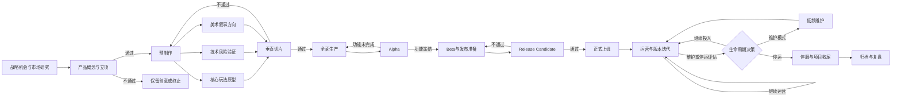
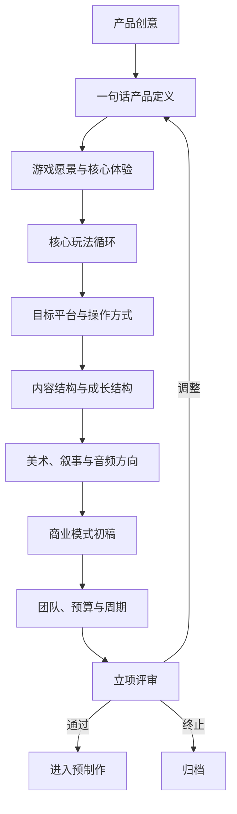
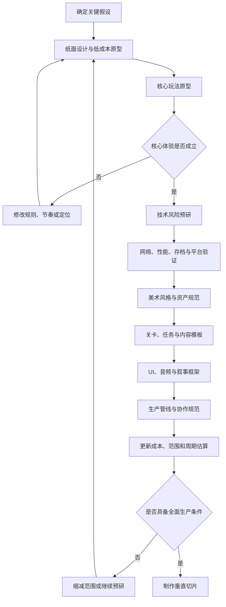
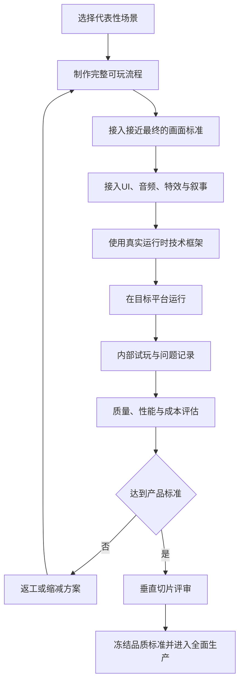
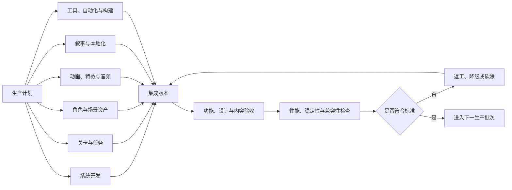
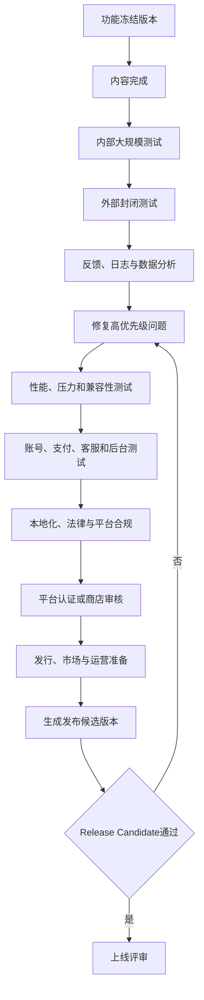
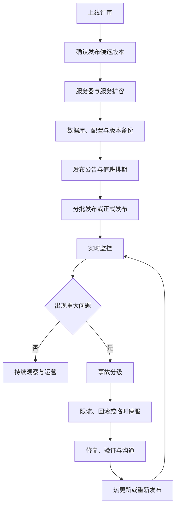
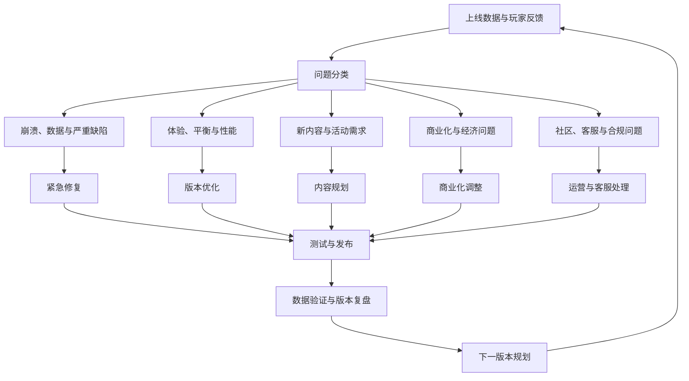
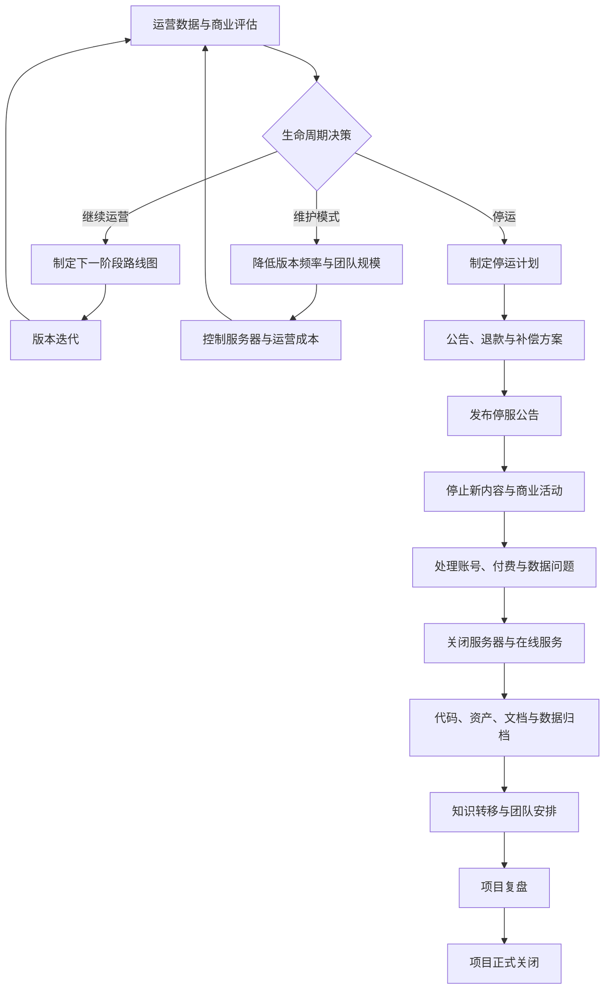

# 商业游戏项目全生命周期参考

本文用于梳理商业游戏从机会发现、立项、研发、上线、运营到停运归档的完整流程，作为项目规划、里程碑评审、跨部门协作和风险管理的参考。

项目阶段不是单向直线。每个关键阶段都应设置评审门，根据证据决定继续、返工、缩减范围、转入维护或终止项目。

## 一、总流程



## 二、阶段一：战略机会与市场研究

### 目标

确认市场机会、目标用户和商业方向，判断是否值得投入产品概念验证。

### 工作内容

- 分析公司战略、平台机会和发行地区。
- 研究目标用户、使用场景和玩家需求。
- 分析竞品、替代产品、品类生命周期和市场空位。
- 初步判断买断制、免费制、订阅制或其他商业模式。
- 估算团队规模、开发周期、预算和运营成本。
- 建立技术、合规、发行和商业风险清单。

### 主要产出

- 市场与竞品分析。
- 目标用户画像。
- 产品机会说明。
- 初步商业模型。
- 初步预算、周期和团队方案。
- 风险清单和待验证假设。

### 重点判断

这一阶段最重要的是回答：

> 产品服务谁，解决什么需求，为什么玩家会选择它？

如果用户、品类和差异化价值无法说清楚，不应直接进入大规模研发。

## 三、阶段二：产品概念与立项



### 必须明确

- 游戏类型、目标玩家和目标平台。
- 一句话产品定位和核心卖点。
- 玩家获得的核心体验。
- 核心循环和长期循环。
- 前 5 分钟、前 30 分钟和前 10 小时的体验目标。
- 内容单位，例如关卡、任务、回合、牌组、角色或赛季。
- 首发范围、后置内容和明确不做的内容。
- 商业模式、预计生命周期和收入假设。
- 团队结构、预算、里程碑和决策负责人。

### 立项评审标准

- 用户和市场机会有证据支持。
- 产品差异化能够被清楚表达。
- 核心体验有可验证的设计假设。
- 范围与预算、周期和团队能力匹配。
- 最大技术风险已有验证计划。
- 项目失败或缩减时有明确止损条件。

### 重点环节：范围控制

立项阶段承诺的内容会决定后续成本。首发范围应服务于核心体验，所有大型系统都要说明它对首发体验的必要性。

## 四、阶段三：预制作

预制作的目标是证明产品值得进入全面生产，并证明团队能够稳定地制作它。



### 预制作工作

- 用低成本方式验证核心玩法、操作手感和节奏。
- 验证多人同步、服务器、AI、战斗、物理、存档和加载等高风险技术。
- 验证目标平台性能、输入方式和兼容性。
- 确定美术风格、形状语言、色彩、镜头和玩家尺度。
- 建立角色、场景、动画、特效、音频和 UI 的制作规范。
- 建立关卡、任务、数值和内容生产模板。
- 确定版本管理、构建、测试、数据收集和缺陷流程。
- 重新估算真实内容产能和制作成本。

### 重点环节：核心玩法与技术风险

核心玩法是否有趣、关键技术是否可行，都应尽量在低成本阶段验证。不要等到大量内容制作完成后才发现产品体验或架构无法成立。

## 五、阶段四：垂直切片

垂直切片是一段短而完整的游戏内容，应同时体现玩法、画面、音频、UI、叙事和技术框架的主要标准。



### 必须验证

- 玩家是否能感受到核心乐趣。
- 各部门产出能否形成统一的最终体验。
- 一个内容单位需要多少人天和返工成本。
- 资产、关卡、任务和数值流程是否可复制。
- 目标平台是否达到性能要求。
- 团队是否理解并能稳定执行品质标准。

### 主要产出

- 可运行的代表性场景。
- 玩法、美术、UI、音频和技术标准样例。
- 内容生产模板和验收规则。
- 工时、成本和产能数据。
- 更新后的范围、预算和里程碑计划。

### 重点环节：生产可复制性

垂直切片不是只展示效果的宣传片。它必须回答：按照当前品质，团队能否持续生产足够多的正式内容。

## 六、阶段五：全面生产

全面生产阶段从“验证产品”转向“稳定交付内容”。



### 生产范围

- 玩家、战斗、AI、任务、成长、经济和社交系统。
- 关卡、任务、角色、场景、道具、动画、特效和音频。
- UI、设置、输入、存档、引导和无障碍能力。
- 运营后台、账号、支付、数据上报、客服和反作弊系统。
- 本地化、平台功能、构建、安装、更新和发布工具。

### 管理重点

- 需求变更和范围削减机制。
- 任务拆分、依赖关系和跨部门排期。
- 资产命名、版本管理、来源和验收状态。
- 生产模板、自动化工具和重复劳动优化。
- 技术债务、返工率、缺陷趋势和版本稳定性。
- 每个里程碑的退出条件，而不是只看完成百分比。

### 重点环节：范围、管线和集成

全面生产最常见的风险是内容数量失控、生产标准不一致和部门集成延迟。每个功能必须有负责人、依赖、验收标准和取消条件。

## 七、阶段六：Alpha

Alpha 的核心定义是：主要功能已经完成，项目从功能开发转向集成、完善和稳定。

### Alpha 应达到

- 主流程可以完整跑通。
- 主要系统已经接入并能共同工作。
- 主要内容框架已经存在。
- 核心技术架构基本确定。
- 阻塞性问题有明确处理计划并持续减少。
- 版本能够稳定构建、安装和运行。
- 团队可以进行完整的内部测试。

### Alpha 之后的规则

- 原则上冻结大型新系统。
- 只允许必要的功能补齐和高价值修正。
- 新需求必须说明对上线范围和日期的影响。
- 优先处理崩溃、数据损坏、流程阻塞和严重体验问题。
- 开始建立上线版本的缺陷优先级和变更审批机制。

### 重点环节：功能冻结

如果 Alpha 之后仍不断增加核心功能，项目会长期处于“接近完成但无法上线”的状态。

## 八、阶段七：Beta 与发布准备

Beta 阶段验证完整产品服务链，而不仅是游戏客户端。



### 发布准备清单

- 安装、启动、更新、卸载和崩溃恢复。
- 登录、注册、账号找回和数据同步。
- 支付、退款、订单异常和补发机制。
- 服务器容量、扩容、备份、监控和故障转移。
- 数据上报、日志、告警和运营报表。
- 客服、举报、封禁、内容审核和隐私政策。
- 多语言文本、字体、字幕和本地化质量。
- 平台成就、云存档、手柄、输入和无障碍支持。
- 目标设备兼容性、加载时间、内存和帧率。
- 发行公告、商店页面、宣传素材和运营排期。
- 事故分级、回滚、停服、补偿和对外沟通预案。

### 重点环节：外部测试与压力测试

内部环境无法覆盖真实用户的设备组合、网络条件、并发量和行为差异。Beta 必须使用接近真实的用户、服务和数据链路。

## 九、阶段八：正式上线



### 上线监控

- 登录成功率、崩溃率和启动失败率。
- 服务器 CPU、内存、网络、数据库和队列。
- 匹配、排队、加载和关键接口耗时。
- 支付成功率、订单异常和退款请求。
- 新手流程流失、关键任务完成和首日留存。
- 玩家举报、客服工单、漏洞和外挂行为。
- 社区舆情、商店评价和平台反馈。

### 上线值班机制

上线前必须确定技术事故、内容数值、客服公告、发行方沟通和运营决策的负责人，并明确哪些情况允许热修、必须回滚或需要临时停服。

### 重点环节：监控与事故响应

上线是一次完整的服务切换。没有实时监控和可执行的回滚方案，就无法判断问题范围，也无法快速恢复玩家服务。

## 十、阶段九：运营与版本迭代



### 运营工作

- Bug 修复、热更新、性能优化和安全维护。
- 新内容、活动、赛季和节日运营。
- 数值、经济、匹配和难度调整。
- 留存、付费、召回和用户生命周期运营。
- 社区、客服、举报、反作弊和舆情管理。
- 服务器、第三方服务、预算和运营成本控制。
- 数据实验、版本复盘和产品路线图调整。

每个版本都应经过：

```text
目标确定 → 方案设计 → 开发制作 → 内部测试
→ 外部验证 → 发布 → 数据观察 → 版本复盘
```

### 重点环节：数据驱动决策

运营不等于持续堆积内容。应根据数据和玩家反馈判断哪些问题真正影响留存、付费、口碑和长期生命周期。

## 十一、阶段十：维护、停运与项目收尾



### 收尾内容

- 停服时间、公告节奏、退款和补偿。
- 用户账号、付费记录、个人数据和隐私义务。
- 客服收尾、工单处理和对外沟通。
- 服务器、域名、第三方服务和合同关闭。
- 代码、资产、文档、构建环境和数据归档。
- 资产授权、依赖、许可证和可复用内容清理。
- 项目经验、问题、指标和决策记录复盘。
- 团队转岗、解散、知识转移和后续责任人安排。

项目只有在用户、数据、合同、资产、代码、文档和团队安排都完成收尾后，才算真正结束。

## 十二、关键评审门

| 评审门 | 核心问题 | 通过后的动作 | 不通过时的动作 |
| --- | --- | --- | --- |
| 立项评审 | 市场、用户、差异化和商业目标是否成立？ | 批准预制作 | 修改概念或终止 |
| 原型评审 | 核心玩法是否有趣并具备差异化？ | 扩展原型和技术验证 | 重做玩法或调整定位 |
| 技术评审 | 最大技术风险是否可控？ | 固化技术路线 | 降级、换方案或终止 |
| 垂直切片评审 | 品质标准和生产方式是否可复制？ | 进入全面生产 | 返工或缩小范围 |
| Alpha 评审 | 功能是否完整，主流程是否可玩？ | 功能冻结 | 补齐阻塞功能 |
| Beta 评审 | 内容、性能、服务和合规是否达标？ | 生成发布候选版本 | 修复、延期或砍内容 |
| 上线评审 | 版本、服务、监控和应急能力是否准备好？ | 正式发布 | 暂缓上线 |
| 运营评审 | 数据是否支持继续投入？ | 继续迭代或扩大投入 | 转维护、调整方向或停运 |
| 停运评审 | 用户、数据、资产和团队是否完成收尾？ | 关闭并归档项目 | 补充收尾工作 |

## 十三、全流程最重要的环节

以下环节最容易造成大规模返工，或直接决定产品能否上线和持续运营：

1. **产品定位与目标用户**：决定团队为谁创造什么体验。
2. **核心玩法原型**：尽早验证玩家是否愿意持续体验。
3. **技术风险验证**：提前验证网络、性能、存档、工具链和平台限制。
4. **垂直切片**：建立最终品质标准并验证生产可复制性。
5. **范围控制与功能冻结**：防止需求膨胀，保证项目能够完成。
6. **生产管线与跨部门集成**：决定内容能否稳定、高质量地交付。
7. **Beta、压力测试、合规与应急预案**：决定产品能否安全公开服务。
8. **上线后的数据运营**：决定产品是否值得继续投入。
9. **停运与知识归档**：决定项目经验和资产能否被组织继续使用。

判断某个环节是否属于重点，可以看三个标准：它是否影响大量后续工作，是否会造成高额返工，是否直接影响上线或持续运营。符合的标准越多，就越应提前验证并设置明确的评审门。

## 十四、阶段交付物总表

| 阶段 | 必要交付物 |
| --- | --- |
| 市场研究 | 用户研究、竞品分析、机会说明、初步预算和风险清单 |
| 产品立项 | 产品定义、核心循环、范围、商业模型、团队和里程碑 |
| 预制作 | 原型、技术验证、美术方向、内容模板、生产规范 |
| 垂直切片 | 完整样例、品质标准、产能数据、更新后的预算和计划 |
| 全面生产 | 系统、关卡、资产、音频、UI、本地化和集成版本 |
| Alpha | 功能完整性报告、阻塞问题清单、功能冻结决策 |
| Beta | 外部测试报告、压力测试、兼容性、合规、发布候选版本 |
| 正式上线 | 发布包、监控面板、值班表、应急预案和运营计划 |
| 运营迭代 | 版本计划、数据报告、缺陷修复、活动和复盘报告 |
| 项目结束 | 停服记录、数据处理、归档包、复盘报告和知识转移记录 |

## 十五、NewWorld 当前阶段映射

结合当前仓库状态，NewWorld 已完成 UE5.8 C++ 工程初始化、项目规则、AI/MCP 生产管线和资产验证基础，当前对应：

```text
工程初始化与生产管线建设
        ↓
产品定义与核心玩法原型 ← 当前重点
        ↓
第一个可玩垂直切片
        ↓
全面生产
```

当前优先级应是：

1. 确定游戏类型、目标玩家和一句话产品定位。
2. 定义核心体验、核心玩法循环和原型成功标准。
3. 用玩家、摄像机、核心动作、交互对象和灰盒地图制作最小可玩原型。
4. 完成 5～15 分钟的内部试玩、问题记录和方向评审。
5. 原型通过后，再制作第一个包含完整体验链的垂直切片。

在核心玩法成立之前，不应批量制作正式美术资产、完整世界观、大规模关卡或复杂联网系统。

